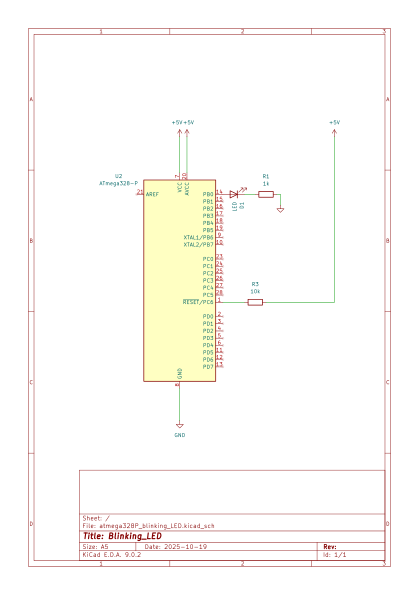
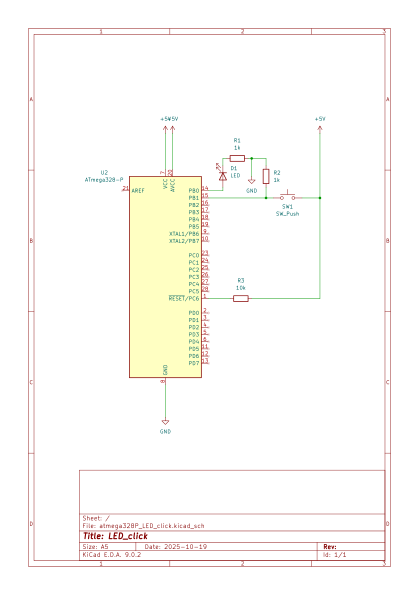
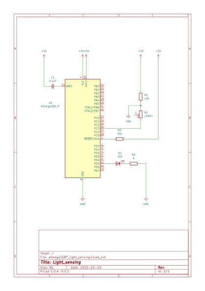

# Hello, AVR!
Repository of tiny projects for getting started with AVR programming in C.

## Setup
For these projects, I am using the ATMega328P and a [USBAsp](https://www.fischl.de/usbasp/) to program it.
### Software Installation
#### Compiling
Get the AVR-GCC toolchain [here](https://www.microchip.com/en-us/tools-resources/develop/microchip-studio/gcc-compilers).


#### Programming
Install [AVRDUDE](https://github.com/avrdudes/avrdude).
```
sudo apt install avrdude
```

### Hardware Setup
insert schematic here

## Projects
List of projects under this repository.
### Blinking LED
Simple blinking LED program, or the "Hello, World!" of embedded programming.
#### Code
[blink.c](src/blink.c)
#### Schematic


### Not LED
Turn off an LED when a button is pressed.
#### Code
[click.c](src/click.c)
#### Schematic


### Who said no light?
Using a light sensor, progressively turn on an LED when the light sensor detects less and less light.
#### Code
[light.c](src/light.c)
#### Schematic

